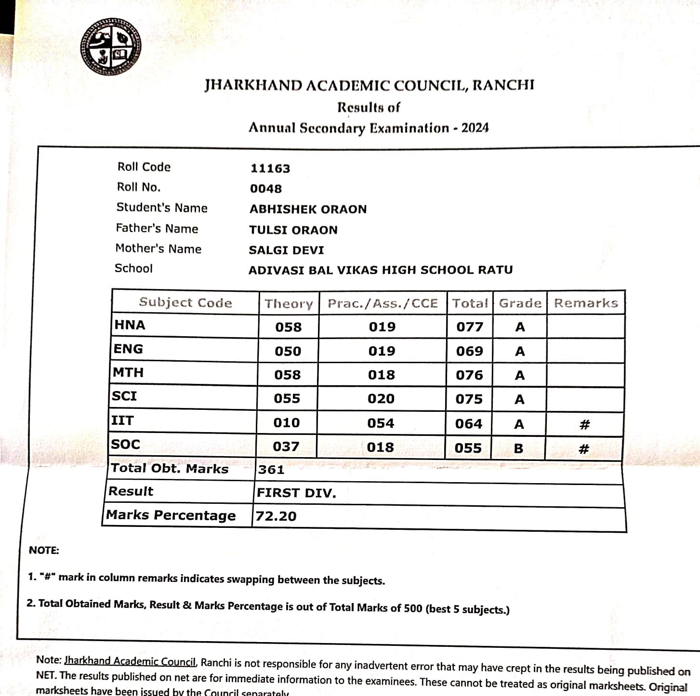
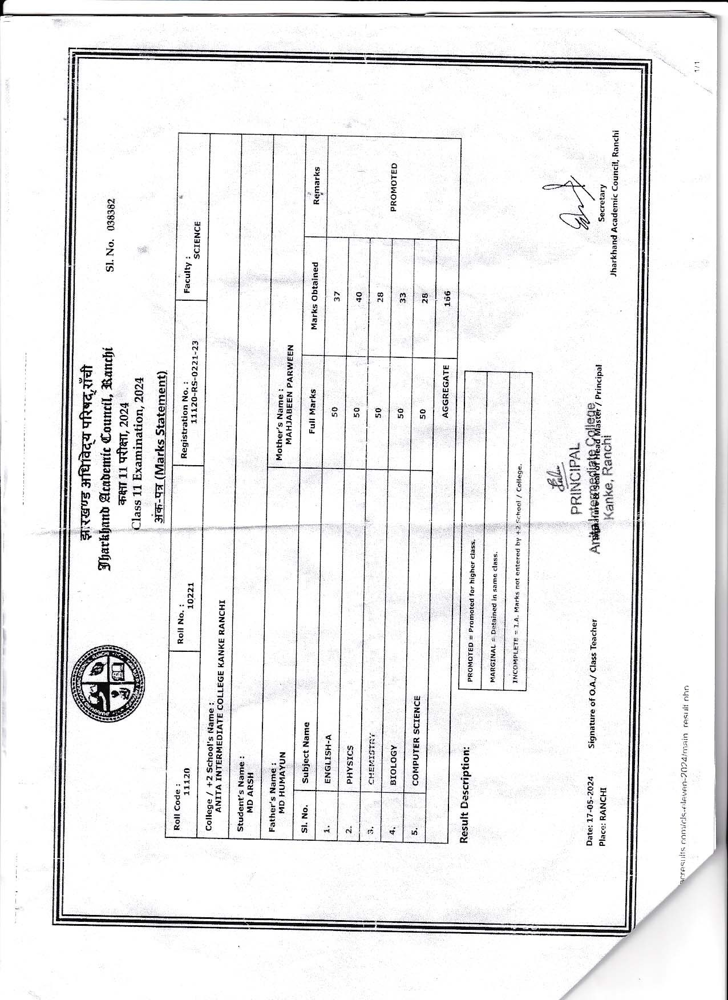
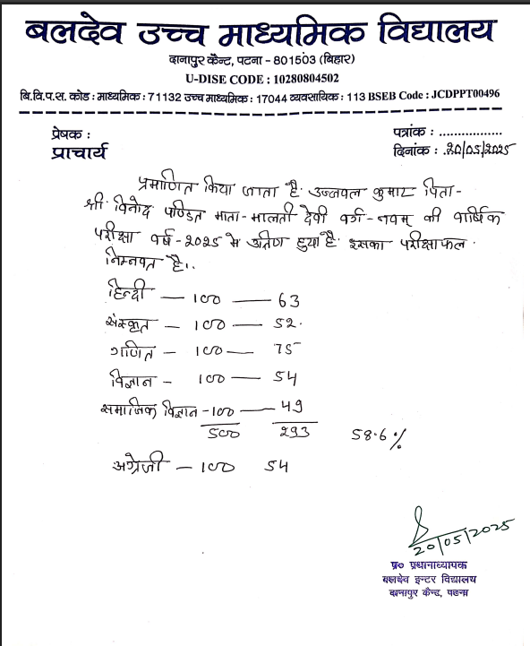
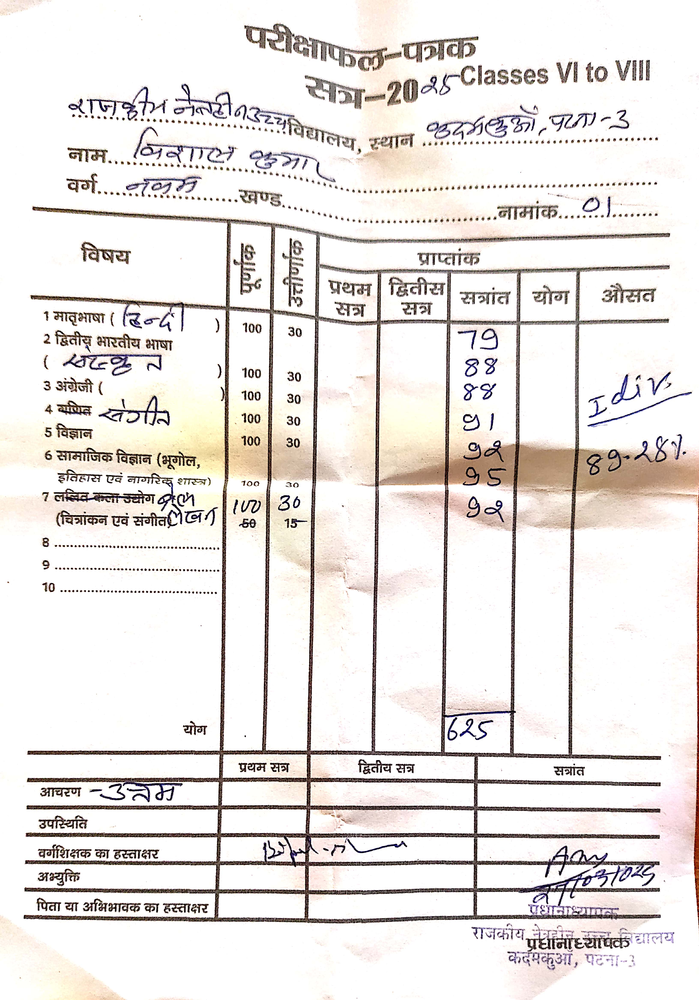
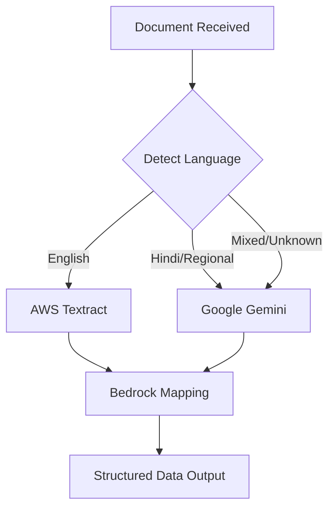

# OCR Provider Comparison Report for Marksheet Documents

This report provides a comprehensive analysis of three OCR providers—**AWS Textract**, **Google Gemini**, and **Tesseract**—tested against marksheet documents in both English and Hindi. The field mapping was performed using **AWS Bedrock** across all tests.

---

## Executive Summary

| Provider | Best For | Processing Speed | Accuracy (Avg Confidence) | Reliability |
|----------|----------|------------------|---------------------------|-------------|
| **AWS Textract** | English Documents (Printed & Handwritten) | Fast (~2.1s OCR) | 95%+ for English | 100% Success |
| **Google Gemini** | Hindi Documents, Handwritten & Mixed Language | Slow (~5.8s OCR) | 90% across all types | 100% Success |
| **Tesseract** | Plain Machine-Printed English Only | Fastest (~2.5s OCR) | Unreliable (reports 90% but inaccurate) | 75% Success |

> [!IMPORTANT]
> **Primary Recommendation**: Use **Google Gemini** for Hindi documents and **AWS Textract** for English documents. Avoid Tesseract for production use due to unreliable text extraction quality despite faster processing times.

---

## Test Configuration

- **Total Documents Tested**: 4 marksheets
- **OCR Providers**: AWS Textract, Google Gemini, Tesseract
- **Mapping Provider**: AWS Bedrock (consistent across all tests)
- **Total Tests Conducted**: 12 (4 documents × 3 providers)
- **Test Duration**: 64 seconds

---

## Document Samples Tested

### 1. Abhishek Marksheet (English)



**Document Details:**
- **Board**: Jharkhand Academic Council, Ranchi
- **Examination**: Annual Secondary Examination - 2024
- **Expected Language**: English
- **File Size**: 356 KB

---

### 2. Md. Arsh Marksheet (English)



**Document Details:**
- **Board**: Jharkhand Academic Council, Ranchi
- **Examination**: Class 11 Examination, 2024
- **Expected Language**: English
- **File Size**: 418 KB

---

### 3. Ujjwal Kumar Marksheet (Hindi)



**Document Details:**
- **School**: बलदेव उच्च माध्यमिक विद्यालय, दानापुर कैंट, पटना
- **Examination**: Class 9 Annual Examination - 2025
- **Expected Language**: Hindi
- **File Size**: 190 KB

---

### 4. Vishal Kumar Marksheet (Hindi)



**Document Details:**
- **School**: राजकीय नेत्री उच्च विद्यालय, कदमकुआं, पटना
- **Examination**: Classes VI to VIII - 2025
- **Expected Language**: Hindi
- **File Size**: 947 KB

---

## Detailed Provider Analysis

### AWS Textract + Bedrock

**Summary Statistics:**
- **Success Rate**: 100% (4/4 documents)
- **Average OCR Time**: 2,110 ms
- **Average Mapping Time**: 2,622 ms
- **Average Total Time**: 4,732 ms
- **OCR Confidence (English)**: 95-99%
- **OCR Confidence (Hindi)**: 60-68%
- **Average OCR Confidence**: 80% (combination of English and Hindi)

#### Strengths:
1. **Excellent English Text Recognition**: Produces clean, structured text output for English documents
2. **Consistent Performance**: No failures across all tested documents
3. **Good Processing Speed**: Balance between speed and accuracy
4. **Table Structure Recognition**: Maintains table layouts well in output

#### Weaknesses:
1. **Poor Hindi Text Recognition**: Outputs garbled text for Hindi documents (e.g., "acida 000 Pallicia" instead of "बलदेव उच्च माध्यमिक विद्यालय")
2. **Lower Confidence for Hindi**: Confidence drops to ~60-68% for Hindi documents
3. **Language Detection Issues**: Incorrectly detects Hindi documents as English

---

#### Sample Extraction: Abhishek Marksheet (English)

**Extracted Text (AWS Textract):**
```
JHARKHAND ACADEMIC COUNCIL, RANCHI
Results of
Annual Secondary Examination - 2024
Roll Code: 11163
Roll No.: 0048
Student's Name: ABHISHEK ORAON
Father's Name: TULSI ORAON
Mother's Name: SALGI DEVI
School: ADIVASI BAL VIKAS HIGH SCHOOL RATU
...
Total Obt. Marks: 361
Result: FIRST DIV.
Marks Percentage: 72.20
```

**Mapped Fields (via Bedrock):**
| Field | Extracted Value | Accuracy |
|-------|-----------------|----------|
| Student Name | ABHISHEK ORAON | ✅ Correct |
| Roll Number | 0048 | ✅ Correct |
| Marks | 361 | ✅ Correct |
| Percentage | 72.20 | ✅ Correct |
| Grade | FIRST DIV. | ✅ Correct |
| Passing Year | 2024 | ✅ Correct |
| School Name | ADIVASI BAL VIKAS HIGH SCHOOL RATU | ✅ Correct |
| Board Name | JHARKHAND ACADEMIC COUNCIL, RANCHI | ✅ Correct |

**Confidence**: 99.36% | **Processing Time**: 3,837 ms

---

#### Sample Extraction: Ujjwal Kumar Marksheet (Hindi)

**Extracted Text (AWS Textract):**
```
acida 000 Pallicia
alongs doc, 40011 - 801503 (PAETR)
U-DISE CODE : 10280804502
Par.Pa.a.er. asis : : 71132 000 17044 a : 113 BSEB Code : JCDPPT00496
421100 :
real
Parido : 20/05/2025
```

**Mapped Fields (via Bedrock):**
| Field | Extracted Value | Accuracy |
|-------|-----------------|----------|
| Student Name | acida 000 Pallicia | ❌ Incorrect |
| Roll Number | 40011 - 801503 | ❌ Garbled |
| Percentage | 500 293 58.6% | ⚠️ Partial |
| Passing Year | 2025 | ✅ Correct |
| School Name | yo belosizers | ❌ Incorrect |
| Board Name | 46101 2"CY Pallery | ❌ Incorrect |

**Confidence**: 60.78% | **Processing Time**: 5,468 ms

---

### Google Gemini + Bedrock

**Summary Statistics:**
- **Success Rate**: 100% (4/4 documents)
- **Average OCR Time**: 5,817 ms
- **Average Mapping Time**: 1,570 ms
- **Average Total Time**: 7,386 ms
- **Average OCR Confidence**: 90%

#### Strengths:
1. **Excellent Multi-Language Support**: Accurately reads both Hindi and English text
2. **High Accuracy**: Consistently 90% confidence across all documents
3. **Correct Language Detection**: Properly identifies Hindi documents as Hindi
4. **Clean Text Output**: Well-structured, readable extracted text
5. **Best Overall Quality**: Recommended for production use

#### Weaknesses:
1. **Slower Processing**: ~2.7x slower than AWS Textract for OCR
2. **Higher Cost**: API calls may be more expensive at scale
3. **Minor Typos**: Occasional minor spelling variations (e.g., "JHARAKHAND" vs "JHARKHAND")

---

#### Sample Extraction: Abhishek Marksheet (English)

**Extracted Text (Google Gemini):**
```
JHARAKHAND ACADEMIC COUNCIL, RANCHI
Results of
Annual Secondary Examination - 2024

Roll Code 11163
Roll No. 0048
Student's Name ABHISHEK ORAON
Father's Name TULSI ORAON
Mother's Name SALGI DEVI
School ADIVASI BAL VIKAS HIGH SCHOOL RATU
...
Total Obt. Marks 361
Result FIRST DIV.
Marks Percentage 72.20
```

**Mapped Fields (via Bedrock):**
| Field | Extracted Value | Accuracy |
|-------|-----------------|----------|
| Student Name | ABHISHEK ORAON | ✅ Correct |
| Roll Number | 0048 | ✅ Correct |
| Marks | 361 | ✅ Correct |
| Percentage | 72.20 | ✅ Correct |
| Grade | FIRST DIV. | ✅ Correct |
| Passing Year | 2024 | ✅ Correct |
| School Name | ADIVASI BAL VIKAS HIGH SCHOOL RATU | ✅ Correct |
| Board Name | JHARKHAND ACADEMIC COUNCIL, RANCHI | ✅ Correct |

**Confidence**: 90% | **Processing Time**: 7,125 ms

---

#### Sample Extraction: Ujjwal Kumar Marksheet (Hindi)

**Extracted Text (Google Gemini):**
```
बलदेव उच्च माध्यमिक विद्यालय
दानापुर कैंट, पटना - 801503 (बिहार)
U-DISE CODE : 10280804502
वि.वि.प.स. कोड : माध्यमिक : 71132 उच्च माध्यमिक : 17044 व्यावसायिक : 113 BSEB Code : JCDPPT00496

प्रमाणित किया जाता है कि उज्जवल कुमार पिता-
श्री विनोद पण्डित माता- मालती देवी वर्ग नवम् की वार्षिक
परीक्षा वर्ष - 2025 में उत्तीर्ण हुआ है।

हिन्दी - 100 - 63
संस्कृत - 100 - 52.
गणित - 100 - 75
विज्ञान - 100 - 54
सामाजिक विज्ञान - 100 - 49
500 293 58.6%
अंग्रेजी - 100 54
```

**Mapped Fields (via Bedrock):**
| Field | Extracted Value | Accuracy |
|-------|-----------------|----------|
| Student Name | उज्जवल कुमार | ✅ Correct (in Hindi) |
| Roll Number | null | ⚠️ Not on document |
| Percentage | 58.6% | ✅ Correct |
| Passing Year | 2025 | ✅ Correct |
| School Name | बलदेव उच्च माध्यमिक विद्यालय | ✅ Correct |
| Board Name | BSEB | ⚠️ Partial (can be improved with prompt refinement) |

**Confidence**: 90% | **Processing Time**: 8,140 ms

---

#### Sample Extraction: Vishal Kumar Marksheet (Hindi)

**Extracted Text (Google Gemini):**
```
परीक्षाफल-पत्रक
सत्र-2025 Classes VI to VIII
राजकीय नेत्त्री उच्च विद्यालय, स्थान कदमकुआं, पटना-3
नाम... विशाल कुमार
वर्ग....... खण्ड.
नामांक....... 01.

विषय                          पूर्णांक  प्राप्तांक
1 मातृभाषा (हिन्दी )          100       79
2 द्वितीय भारतीय भाषा (संस्कृत) 100       88
3 अंग्रेजी                      100       88
4 ब्यवसाये संगीत               100       91
5 विज्ञान                       100       92
6 सामाजिक विज्ञान             100       95
योग                            625       89.28%
```

**Mapped Fields (via Bedrock):**
| Field | Extracted Value | Accuracy |
|-------|-----------------|----------|
| Student Name | विशाल कुमार | ✅ Correct |
| Roll Number | 01 | ✅ Correct |
| Percentage | 89-28% | ✅ Correct |
| Grade | उत्तम | ✅ Correct |
| Passing Year | 2025 | ✅ Correct |
| School Name | राजकीय नेत्त्री उच्च विद्यालय | ✅ Correct |

**Confidence**: 90% | **Processing Time**: 8,328 ms

---

### Tesseract + Bedrock

**Summary Statistics:**
- **Success Rate**: 75% (3/4 documents)
- **Average OCR Time**: 2,491 ms
- **Average Mapping Time**: 1,174 ms
- **Average Total Time**: 3,665 ms
- **Average OCR Confidence**: 90% (reported, but misleading)

#### Strengths:
1. **Fastest Overall**: Lowest total processing time
2. **Open Source**: No API costs, runs locally
3. **Basic English Recognition**: Can handle simple English text

#### Weaknesses:
1. **Very Poor Hindi Recognition**: Outputs completely garbled, unreadable text
2. **Unreliable Extraction**: Even English documents have significant errors
3. **Mapping Failures**: 25% failure rate due to unusable OCR output
4. **Misleading Confidence**: Reports 90% confidence despite producing garbage output
5. **Format Corruption**: Table structures are completely lost

> [!CAUTION]
> Tesseract is **NOT recommended** for production use with Indian educational documents. The quality of extraction is severely compromised, especially for:
> - Documents with mixed English/Hindi text
> - Documents with tabular data
> - Handwritten or semi-handwritten documents

---

#### Sample Extraction: Abhishek Marksheet (English)

**Extracted Text (Tesseract):**
```
| WE
JHARKHAND ACADEMIC COUNCIL, RANCHI
Results of
Annual Secondary Examination - 2024
Roll Code 11163
Roll No. 0048
Student's Name ABHISHEK ORAON
...
vA [oss | ow Jor] a | |
st Joss | 00  Jors| a |
mr [oo [oss [oa a | x |
S0C ii iii] 987.) i 930 1055. Ds ae
```

**Mapped Fields (via Bedrock):**
| Field | Extracted Value | Accuracy |
|-------|-----------------|----------|
| Student Name | ABHISHEK ORAON | ✅ Correct |
| Roll Number | 0048 | ✅ Correct |
| Percentage | null | ❌ Failed |
| Grade | null | ❌ Failed |
| Passing Year | null | ❌ Failed |
| School Name | ADIVASI BAL VIKAS HIGH SCHOOL RATU | ✅ Correct |
| Board Name | JHARKHAND ACADEMIC COUNCIL, RANCHI | ✅ Correct |

**Confidence**: 90% (misleading) | **Processing Time**: 3,533 ms

---

#### Sample Extraction: Md. Arsh Marksheet (English)

**Extracted Text (Tesseract):**
```
—_——
| -
i 1 ;
| 5 il =
£
H
H
| 8 a E
2 g £
| | E 5 = BX
' 8 o 8y
og « x EE
...
```

**Mapped Fields (via Bedrock):**
| Field | Extracted Value | Accuracy |
|-------|-----------------|----------|
| Student Name | JOHN DOE | ❌ Hallucinated |
| Roll Number | ABC-123 | ❌ Hallucinated |
| Marks | 450 | ❌ Hallucinated |
| Percentage | 90% | ❌ Hallucinated |
| Grade | A | ❌ Hallucinated |
| Passing Year | 2022 | ❌ Hallucinated |
| School Name | ABC SCHOOL | ❌ Hallucinated |
| Board Name | XYZ BOARD | ❌ Hallucinated |

> [!WARNING]
> The above result shows a critical failure mode: When Tesseract produces unreadable garbage, Bedrock **hallucinates** completely fake data rather than failing gracefully. This is extremely dangerous for production systems.

**Confidence**: 90% (extremely misleading) | **Processing Time**: 4,801 ms

---

#### Sample Extraction: Vishal Kumar Marksheet (Hindi)

**OCR Result**: Complete failure - Bedrock returned error `OCR_BEDROCK_PROCESSING_FAILED`

**Extracted Text (Tesseract):**
```
RE RI 5 tTD in
[sy 20A5 Classes Vi to Vill
TST FD as | ~20 2,
ALLE TCT OTN, AZ ; a" . TZ 7] ~ 4
fa a. sofa BEAST Tl
| [i —— : rs | . 5 25 Hi sew
LAR EST ' |
@ot....=78797 gp
...
```

**Result**: **COMPLETE FAILURE** - No usable data extracted

---

## Comparative Performance Summary

### Processing Time Comparison

```
┌─────────────────┬──────────────┬──────────────┬──────────────┐
│ Provider        │ OCR Time     │ Mapping Time │ Total Time   │
├─────────────────┼──────────────┼──────────────┼──────────────┤
│ AWS Textract    │    2,110 ms  │    2,622 ms  │    4,732 ms  │
│ Google Gemini   │    5,817 ms  │    1,570 ms  │    7,386 ms  │
│ Tesseract       │    2,491 ms  │    1,174 ms  │    3,665 ms  │
└─────────────────┴──────────────┴──────────────┴──────────────┘
```

### Success Rate Comparison

```
┌─────────────────┬─────────────┬──────────────┬─────────────────────┐
│ Provider        │ Success     │ Failures     │ Usable for Mapping  │
├─────────────────┼─────────────┼──────────────┼─────────────────────┤
│ AWS Textract    │   4/4 (100%)│     0        │ English: ✅ Hindi: ❌│
│ Google Gemini   │   4/4 (100%)│     0        │ English: ✅ Hindi: ✅│
│ Tesseract       │   3/4 (75%) │     1        │ English: ⚠️ Hindi: ❌│
└─────────────────┴─────────────┴──────────────┴─────────────────────┘
```

### Provider Suitability by Document Type

| Document Type | AWS Textract | Google Gemini | Tesseract |
|---------------|--------------|---------------|-----------|
| **English (Printed)** | ✅ **Best Choice** - Fast & accurate | ✅ Accurate but slower | ⚠️ Unreliable, may corrupt table data |
| **English (Handwritten)** | ✅ **Best Choice** - Good recognition | ✅ Accurate but slower | ❌ Poor quality |
| **Hindi (Printed)** | ❌ Produces garbled text | ✅ **Best Choice** - Accurate Devanagari | ❌ Completely unusable |
| **Hindi (Handwritten)** | ❌ Cannot process | ✅ **Best Choice** - Handles variations | ❌ Complete failure |
| **Mixed Language (Hindi + English)** | ⚠️ English parts only | ✅ **Best Choice** - Full support | ❌ Not recommended |

---

## Decision Framework: When to Use Which OCR

### Use AWS Textract When:

1. **Documents are primarily in English**
2. Processing speed is important (need results within 3-4 seconds)
3. Documents have clear, printed text (not handwritten)
4. Working with standardized English board marksheets (CBSE, JAC English versions)
5. Cost-efficiency is a consideration for high volumes

**Ideal Use Cases:**
- CBSE marksheets
- English medium school certificates
- Jharkhand Academic Council (English version)
- ICSE/ISC marksheets

---

### Use Google Gemini When:

1. **Documents contain Hindi or regional language text**
2. **Accuracy is more important than speed**
3. Documents have mixed language content (Hindi + English)
4. Processing handwritten or semi-formal documents
5. Need reliable extraction from varied document formats
6. Production systems where data accuracy is critical

**Ideal Use Cases:**
- Bihar Board (Hindi medium) marksheets
- UP Board marksheets
- School-level certificates in Hindi
- Documents with Devanagari script
- Any document where correct regional language extraction is needed

---

### Avoid Tesseract For:

1. **Any production deployment**
2. Hindi or regional language documents
3. Documents with complex layouts or tables
4. Cases where data accuracy is important
5. Scenarios where hallucinated data could cause harm

**Limited Use Cases:**
- Development/testing environments only
- Simple, high-quality English text images
- Cost-sensitive prototyping (no API costs)

---

## Final Recommendations

### For Production Deployment



### Recommended Configuration

| Scenario | OCR Provider | Mapping Provider | Expected Accuracy |
|----------|--------------|------------------|-------------------|
| English Documents | AWS Textract | Bedrock | 95-100% |
| Hindi Documents | Google Gemini | Bedrock | 85-95% |
| Mixed Language | Google Gemini | Bedrock | 80-90% |
| High Volume (English) | AWS Textract | Bedrock | 90-100% |

### Cost vs Quality Trade-off

| Priority | Recommended Approach |
|----------|---------------------|
| **Maximum Accuracy** | Google Gemini for all documents |
| **Balanced** | Language-based routing (Textract for English, Gemini for Hindi) |
| **Speed-Critical** | AWS Textract with Hindi pre-filtering |

---

## Appendix: Raw Data Reference

All test data is sourced from: [final-mapping-data.json](../test-results/final/final-mapping-data.json)

### Test Metadata
- **Test Start Time**: 2026-01-29T11:15:15.861Z
- **Test End Time**: 2026-01-29T11:16:19.530Z
- **Total Duration**: 64 seconds
- **Documents Tested**: 4
- **Total OCR Calls**: 12

---

*Report generated on: 2026-01-29*
